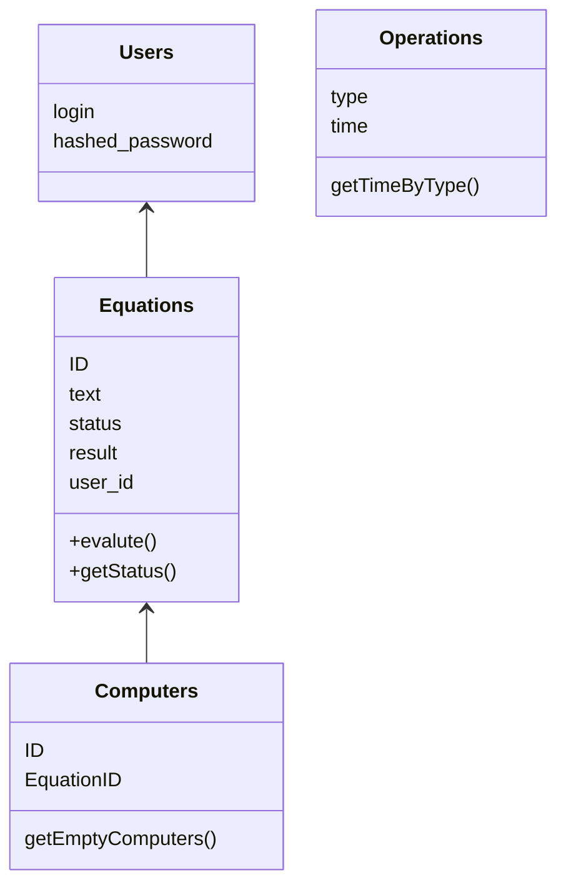

# DistributedCalculator
## Развертывание
1. Склонируйте репозиторий
2. Установите зависимости
```bash
go mod download
```
3. Запустите сервер
```bash
go run main.go
```
4. После запуска автоматически создадутся таблицы в базе данных, а также файл с логами
## Использование
Сервер доступен по адресу `http://localhost:8080`
На главной странице присутствует возможность добавления новых выражений, а также возможность получить json-ответ на запрос `GET /get/expression_id`
## Примеры запросов
Приложение поддерживает веб-интерфейс, а также возможность отправлять запросы через curl.
### Регистрация нового пользователя
```bash
curl -X POST -H "Content-Type: application/json" -d '{"login": "your_username", "password": "your_password"}' http://localhost:8080/api/v1/register
```
### Авторизация
```bash
curl -X POST -H "Content-Type: application/json" -d '{"login": "your_username", "password": "your_password"}' http://localhost:8080/api/v1/login
```
### Получение выражения по id
```bash
curl -X POST -H "Content-Type: application/json" -d '{"login": "your_username", "password": "your_password"}' http://localhost:8080/api/v1/register
```

## Тестирование
Для тестирования запустите команду
```bash
go test ./...
```

## Структура проекта

## Принцип работы Агента
- Первичнаяя обработка `((( 2 +2) + 1.2))` -> `(2+2)+1.2`
- Вычисление
Вычисление производится рекурсивно. Вначале ищется самая последняя операция которая будет выполнена, затем выражение делится на две части и рекурсивно вызывается функция вычисления. Если в выражении нет операций, то возвращается само число.

```mermaid
gantt
    title 1 вычислитель
    dateFormat sss
    axisFormat %L ms

    section   
    (1+2)+(3+4) :b1, 0, 0.004s

    (1+2) :b2, 0, 0.002s
    (3+4) :b3, after b5, 0.002s

    1: b4, 0, 0.001s
    2: b5, after b4, 0.001s
    3: b6, after b5, 0.001s
    4: b7, after b6, 0.001s
```

```mermaid
gantt
    title 2 вычислителя
    dateFormat sss
    axisFormat %L ms

    section   
    (1+2)+(3+4) :b1, 0, 0.002s

    (1+2) :b2, 0, 0.001s
    (3+4) :b3, after b5, 0.001s

    1: b4, 0, 0.001s
    2: b5, 0, 0.001s
    3: b6, after b4, 0.001s
    4: b7, after b4, 0.001s
```

```mermaid
gantt
    title 4 вычислителя
    dateFormat sss
    axisFormat %L ms

    section   
    (1+2)+(3+4) :b1, 0, 0.001s

    (1+2) :b2, 0, 0.001s
    (3+4) :b3, 0, 0.001s

    1: b4, 0, 0.001s
    2: b5, 0, 0.001s
    3: b6, 0, 0.001s
    4: b7, 0, 0.001s
```



