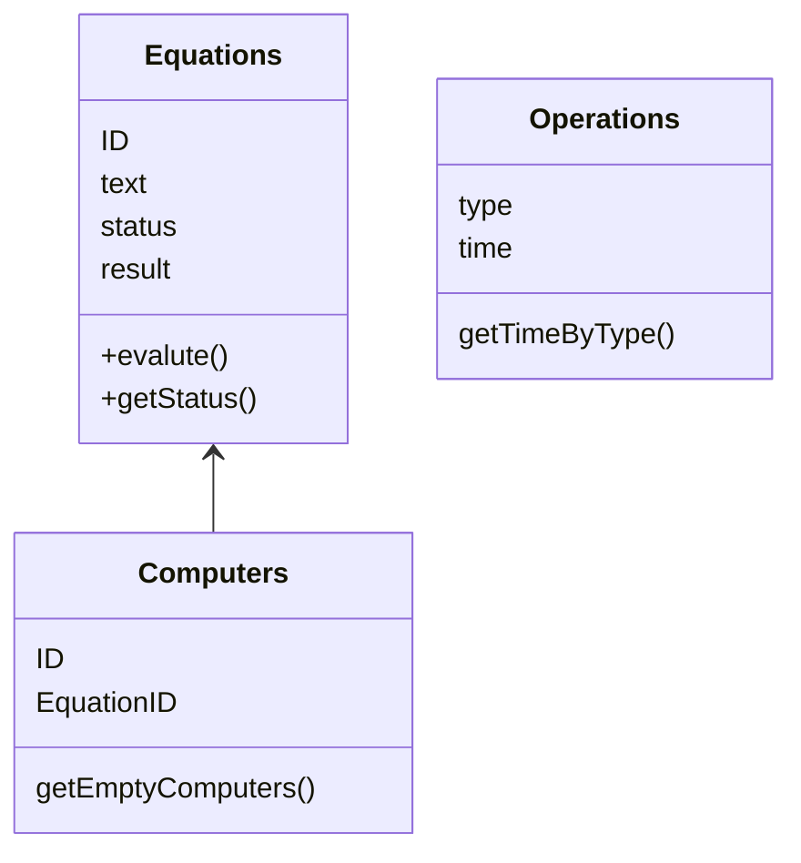

# DistributedCalculator
## Развертывание
1. Склонируйте репозиторий
2. Установите зависимости
```bash
go mod download
```
3. Запустите сервер
```bash
go run main.go
```
4. После запуска автоматически создадутся таблицы в базе данных, а также файл с логами
## Использование
Сервер доступен по адресу `http://localhost:8080`
На главной странице присутствует возможность добавления новых выражений, а также возможность получить json-ответ на запрос `GET /get/expression_id`
## Примеры запросов
### Добавление выражения
Стоит учитывать, что символ `+` часто интерпретируется как пробел. Это стандартное поведение при кодировании URL. Если вы хотите передать символ "+", вам нужно его закодировать. В URL кодировании "+" становится "%2B".
```bash
curl -X POST -d "text=1%2B2-3*4/5" http://localhost:8080/add_equation
```
### Проверка состояния выражения
```bash
curl http://localhost:8080/get/1
```
### Обновелние времени выполнения операции
На `/update_operations` можно отправлять POST-запросы с параметрами вида `time_+=1`, `time_-=1`, `time_*=1`, `time_/=1`. Все они обновляют соответствующие поля в базе данных на 1.
```bash
curl -X POST -d "time_%2B=1&time_-=1&time_*=1&time_/=1" http://localhost:8080/update_operations
```
### Добавление нового вычислителя
Для увеличения количества одновременно работующих горутин можно добавить нового вычислителя.
```bash
curl -X POST http://localhost:8080/add_computer
```
## Структура проекта

## Принцип работы Агента
- Первичнаяя обработка `((( 2 +2) + 1.2))` -> `(2+2)+1.2`
- Вычисление
Вычисление производится рекурсивно. Вначале ищется самая последняя операция которая будет выполнена, затем выражение делится на две части и рекурсивно вызывается функция вычисления. Если в выражении нет операций, то возвращается само число.

```mermaid
gantt
    title 1 вычислитель
    dateFormat sss
    axisFormat %L ms

    section   
    (1+2)+(3+4) :b1, 0, 0.004s

    (1+2) :b2, 0, 0.002s
    (3+4) :b3, after b5, 0.002s

    1: b4, 0, 0.001s
    2: b5, after b4, 0.001s
    3: b6, after b5, 0.001s
    4: b7, after b6, 0.001s
```

```mermaid
gantt
    title 2 вычислителя
    dateFormat sss
    axisFormat %L ms

    section   
    (1+2)+(3+4) :b1, 0, 0.002s

    (1+2) :b2, 0, 0.001s
    (3+4) :b3, after b5, 0.001s

    1: b4, 0, 0.001s
    2: b5, 0, 0.001s
    3: b6, after b4, 0.001s
    4: b7, after b4, 0.001s
```

```mermaid
gantt
    title 4 вычислителя
    dateFormat sss
    axisFormat %L ms

    section   
    (1+2)+(3+4) :b1, 0, 0.001s

    (1+2) :b2, 0, 0.001s
    (3+4) :b3, 0, 0.001s

    1: b4, 0, 0.001s
    2: b5, 0, 0.001s
    3: b6, 0, 0.001s
    4: b7, 0, 0.001s
```


